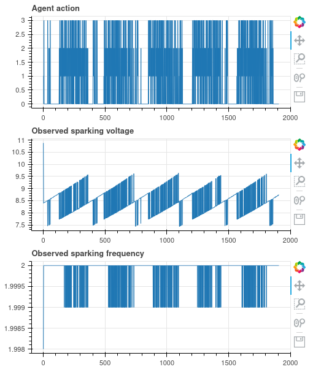

# EDM

AI4EU components of the EDM RL control challenge. 

The **edm-env** component is a gym based EDM environment that emulates rib machining pattern, with 4 
available actions for z-axis control: 0 (stay), 1 (lower by 10µm), 2 (raise by 10µm), 3 (flush).
Environment returns observed average voltage of the sparks, and the frequency of sparking 
(normalized).

The **edm-agent** component is an RL agent that controls the environment based on the
observed voltage and frequencies. It is based on the PPO algorithm and was trained using
the `train.py` script. The weights of the trained agent are stored in the `agent_weights.pt` file. 

# Building from source

To build AI4EU components from source run

    cd edm/

    docker build -t eu.gcr.io/ai4eu-33/edm-agent:1.0 -f ai4eu_agent/Dockerfile .
    docker build -t eu.gcr.io/ai4eu-33/edm-env:1.0 -f ai4eu_env/Dockerfile .

    docker push eu.gcr.io/ai4eu-33/edm-agent:1.0
    docker push eu.gcr.io/ai4eu-33/edm-env:1.0

# Running a demo

To run a demo locally run

    cd edm/

    docker-compose up --build

and open url localhost:8062 on your browser.